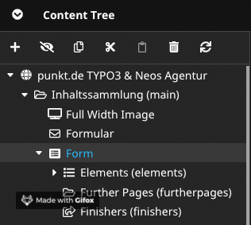
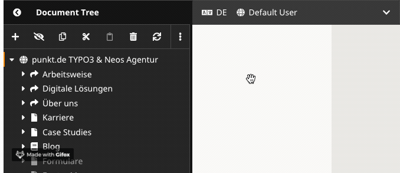

Neos Mautic Plugin
====================

This Plugin enables the usage of Marketing Automation Tool Mautic together with Neos CMS. Its key features are:

- Add Mautic Tracking in two easy steps
- Data Collection via Neos Forms & Neos FormBuilder Forms
- SEO friendly dynamic content

# Installation
Add the following code to your composer.json (or expand your `repositories` if already existing)

    "repositories": [
        {"type": "git", "url": "git@github.com:punktDe/Mautic.git"}
      ],
    
 
Add the dependency to your requirements in the composer.json:

    "punktde/mautic": "@dev"
    
Run `composer update` in your project. 

This is going to change as soon as this package will be avaibale at packagist. 

# Configuration

### Configure Mautic

- Visit your Mautic installation and [create a user for API](https://mautic.com/help/users-and-roles/). 
- [Enable API and HTTP basic auth](https://mautic.com/help/api-quick-start/). Optional: Be sure your Mautic installation 
is running on HTTPS for the sake of security.
- Skip this, if your website and Mautic are running on the same server:
    - [Enable CORS](https://mautic.com/help/getting-started-mautic-cloud/#4), add your site to `valid domains`.

### Configure Plugin

Add the following configuration to your site's Settings.yaml

    PunktDe:
      Mautic:
        mauticServer:
          url: https://mymautic.com
        mauticUser:
          username: mautic-api
          password: 
          
# Enable Tracking

- Ensure you have entered the correct Mautic URL in your configuration.
- Place Mautic tracking template at the bottom of your `<body>`:

  ```
  mautic = PunktDe.Mautic:MauticTracking
  ```
    
Add this code to every page's fusion file you want to be tracked. If you want to track all pages, add this 
piece to the `Root.fusion` or `AbstractPage.fusion` of your page.

# Pass Information from Form to Mautic

### Form in yaml format

To pass information from yaml forms to Mautic, you need to define which form elements should be taken into account.
Add the following property to those fields:   

    mauticIdentifier: 'firstname'


You also need to add the following finisher:

    identifier: 'PunktDe.Mautic:UpdateUser'
    

An example form looks like this:

    type: 'Neos.Form:Form'
    identifier: 'form-identifier'
    label: 'Blog comment'
    renderingOptions:
      submitButtonLabel: 'Send'
    renderables:
      -
        type: 'Neos.Form:Page'
        identifier: 'blog-comment'
        renderables:
          -
            type: 'Neos.Form:SingleLineText'
            identifier: 'name'
            label: 'Name'
            properties:
              mauticIdentifier: 'firstname'
            defaultValue: ''
    finishers:
      -
        identifier: 'PunktDe.Mautic:UpdateUser'

The value of `mauticIdentifier` must be a defined user field (so called custom field) in Mautic. You can search, edit or create new
[custom fields](https://www.mautic.org/docs/en/contacts/manage_fields.html) to fit your needs. 


### Form in FormBuilder Format

Forms created by FormBuilder require the editor to enter the Mautic identifier in the Neos backend. This can be achieved by selecting
the form element and setting up the value in the settings bar on the right side of your UI.

You must also register the Mautic finisher for this form. 




# Dynamic Content

You can show a different content dimension to users belonging to different Mautic segments.

- [Create a new segment in Mautic](https://mautic.com/help/segments/).
- Define segments in your `settings.yaml`. Use the same name for your Neos dimensions as well as your mautic segments.


    Neos:
      ContentRepository:
        contentDimensions:
          mautic:
            label: 'Mautic Segment'
            icon: 'icon-globe'
            default: defaultUser
            defaultPreset: defaultUser
            presets:
              all: null
              defaultUser:
                label: 'Default User'
                values:
                  - defaultUser
                uriSegment: ''
              twitter:
                label: twitter
                values:
                  - twitter
                uriSegment: twitter

- You can combine multiple dimensions (e.g. language) without problem.
- Visit the backend, change the dimension and edit content. Publish it.  


